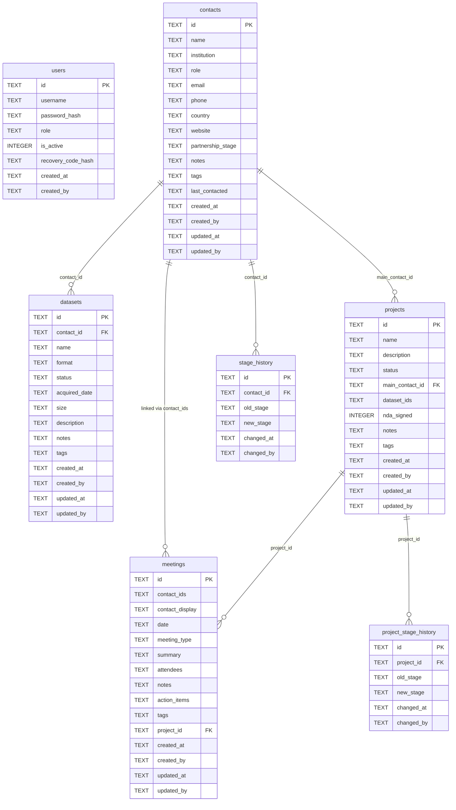

# Research Partnership CRM

A lightweight, multi-user CRM built with Streamlit for tracking research partnership leads, meeting notes, and datasets. Designed to be deployed on **Domino Data Lab**.

---

## Features

| Feature | Detail |
|---|---|
| **Contact management** | Create, view, and edit partner contacts with institution, role, stage, tags, and notes |
| **Partnership stages** | Prospect → Initial Contact → Proposal Sent → In Negotiation → Active Partnership → On Hold → Inactive |
| **Meeting log** | Log meetings from the Meetings page; link to multiple existing contacts and/or free-text names. Automatically updates "Last Contacted" on all linked contacts |
| **Dataset tracker** | Add datasets from the Datasets page with a required main contact point; full status pipeline (Requested → Archived) |
| **Dashboard** | KPI metrics, stage distribution chart, meetings-per-month chart, dataset pipeline counts, and follow-up alerts for contacts not reached in 60+ days |
| **Three-tier roles** | Admin (full access), Editor (create + edit own records), Viewer (read-only). All changes stamped with username and timestamp |
| **User management** | Admins create accounts, assign roles, activate/deactivate users, and reset passwords. Passwords are bcrypt-hashed and never visible to anyone |
| **Self-service password change** | Any user can change their own password from the sidebar. Requires the current password to confirm |
| **Activity log** | Full audit trail of every create/update action and who performed it, visible to admins |
| **CSV export** | Export contacts, meetings, datasets, or the activity log to CSV from within the app |
| **Concurrent access** | SQLite WAL mode + a threading lock prevent data corruption when multiple users write simultaneously |

---

## Project structure

```
micro-crm/
├── app.py              # Main Streamlit application
├── app.sh              # Domino App launcher script
├── requirements.txt    # Python dependencies
├── README.md           # This file
└── data/               # Auto-created at runtime — SQLite database lives here
    └── crm.db          # Single-file database (users, contacts, meetings, datasets)
```

> **Important:** The `data/` directory (and therefore `crm.db`) must be on **persisted storage** in Domino (see Step 4 below), otherwise data is lost when the workspace or app restarts.

---

## Data model



---

## Backend: SQLite

All data is stored in a single SQLite file (`crm.db`) inside `CRM_DATA_DIR`. SQLite is embedded directly in the Python process — no separate database server is required. This makes it ideal for Domino: just point `CRM_DATA_DIR` at a persisted dataset mount and the database file travels with it.

Concurrent writes from multiple Streamlit sessions are serialised by a threading lock; reads are unrestricted thanks to SQLite's WAL (Write-Ahead Logging) mode.

---

## Deployment on Domino Data Lab — step by step

### Step 1 — Create a Domino Dataset for persistent storage

1. In the Domino UI, go to your project and click **Data** in the left sidebar.
2. Click **Create Dataset** and name it `crm_data`.
3. Note the mount path shown — it will be something like `/domino/datasets/local/crm_data`. The `crm.db` file will be stored here.

### Step 2 — Set the data directory environment variable

1. In your Domino project, go to **Settings → Environment Variables**.
2. Add a new variable:
   - **Name:** `CRM_DATA_DIR`
   - **Value:** `/domino/datasets/local/crm_data`
3. Save. This tells the app where to create and read `crm.db`.

> If you skip this step, the app falls back to a local `data/` folder inside the workspace, which **will not persist** between restarts.

### Step 3 — Upload the project files

Upload (or sync via Git) these files into your Domino project:

```
app.py
app.sh
requirements.txt
```

You can do this via the Domino file browser, the Domino CLI (`domino upload`), or by connecting a Git repository.

### Step 4 — Install dependencies

Open a Domino workspace terminal and run:

```bash
pip install -r requirements.txt
```

Alternatively, bake the dependencies into your Domino **Environment** (Docker image) so they are always available. To do that:

1. Go to **Environments** in the Domino sidebar.
2. Edit or create an environment and add the following to the Dockerfile instructions:
   ```
   RUN pip install streamlit>=1.35.0 pandas>=2.0.0 plotly>=5.18.0 bcrypt>=4.1.0
   ```
3. Build the environment and select it for your project.

### Step 5 — Publish as a Domino App

1. In your project, click **Publish → App**.
2. Set the **App file / command** to:
   ```
   app.sh
   ```
3. Make sure `app.sh` is executable. If it is not, open a workspace terminal and run:
   ```bash
   chmod +x app.sh
   ```
4. Set **Hardware tier** to whatever is appropriate (the app is lightweight — the smallest tier is fine).
5. Click **Publish**.
6. Domino will build the app and give you a shareable URL.

### Step 6 — First-time setup (create the admin account)

1. Open the app URL in your browser.
2. You will be prompted to **create the first admin account**. This only appears once when no users exist.
3. Enter a username and password, then click **Create Admin Account**.
4. Log in with those credentials.

### Step 7 — Add more users

1. Log in as admin and navigate to **Admin Panel → User Management**.
2. Click **Create New User**, enter a username, temporary password, and select a role:
   - **Viewer** — read-only access (default)
   - **Editor** — can create records and edit their own entries
   - **Admin** — full access including user management
3. Share the app URL and credentials with your colleagues. They can log in immediately and change their own password via **Change Password** in the sidebar.

---

## Roles and permissions

There are three roles. Admins assign roles when creating or updating a user account.

| Action | Admin | Editor | Viewer |
|---|---|---|---|
| View all contacts, meetings, datasets, dashboard | Yes | Yes | Yes |
| Export CSV | Yes | Yes | Yes |
| Change own password | Yes | Yes | Yes |
| Create new contacts | Yes | Yes | No |
| Log new meetings (link multiple contacts or free-text names) | Yes | Yes | No |
| Add new datasets | Yes | Yes | No |
| Edit **own** contacts / meetings / datasets | Yes | Yes | No |
| Edit **other people's** contacts / meetings / datasets | Yes | No | No |
| Delete **own** records | Yes | Yes | No |
| Delete **other people's** records | Yes | No | No |
| Access Admin Panel / manage users / reset others' passwords | Yes | No | No |

Every write action is stamped with the logged-in username and an ISO timestamp. The full audit trail is visible to admins under **Admin Panel → Activity Log**.

Passwords are stored as bcrypt hashes. No one — including admins — can read a user's password. Admins can only overwrite it (force a reset without knowing the old one). Users changing their own password must supply their current password first.

---

## Running locally (development)

```bash
# 1. Clone or download the project
cd micro-crm

# 2. Create a virtual environment (optional but recommended)
python -m venv .venv
source .venv/bin/activate   # Windows: .venv\Scripts\activate

# 3. Install dependencies
pip install -r requirements.txt

# 4. Run the app
streamlit run app.py
```

The app opens at `http://localhost:8501`. The database (`crm.db`) is created automatically in the `data/` folder next to `app.py`.

---

## Changing the data directory

The app reads the `CRM_DATA_DIR` environment variable. You can override it anywhere:

```bash
# In your shell
export CRM_DATA_DIR=/path/to/shared/folder
streamlit run app.py

# Or inline
CRM_DATA_DIR=/mnt/nfs/crm_data streamlit run app.py
```

This is useful if you want to point multiple Domino workspaces or app instances at the same shared NFS / dataset mount.

---

## Backing up your data

All data lives in a single file:

| File | Contents |
|---|---|
| `crm.db` | Everything — users, contacts, meetings, datasets |

To back up, copy `crm.db`. To restore, stop the app and replace `crm.db` with your backup copy.

You can also take a safe online backup using SQLite's built-in tool:

```bash
sqlite3 /path/to/crm_data/crm.db ".backup /path/to/backup/crm_backup.db"
```

---

## Troubleshooting

**"Data is lost after a workspace restart"**
→ Make sure `CRM_DATA_DIR` points to a Domino Dataset mount, not the workspace filesystem.

**"Permission denied writing to data directory"**
→ The Domino Dataset may have been mounted read-only. Check your dataset permissions in Domino's Data settings.

**"database is locked" error**
→ Rare with WAL mode. If it persists, it usually means a previous process crashed mid-write. Stop the app, then run `sqlite3 crm.db "PRAGMA integrity_check;"` to verify the database is healthy before restarting.

**"bcrypt not found" / import errors**
→ Run `pip install -r requirements.txt` in your workspace, or bake the dependencies into your Domino Environment image.

**App is slow to load**
→ The app queries SQLite on each page render. For very large datasets (tens of thousands of rows) you can add indexes:
```sql
CREATE INDEX IF NOT EXISTS idx_contacts_name ON contacts(name);
CREATE INDEX IF NOT EXISTS idx_meetings_date ON meetings(date);
CREATE INDEX IF NOT EXISTS idx_datasets_contact ON datasets(contact_id);
```
Run these once via `sqlite3 crm.db` in a workspace terminal.
